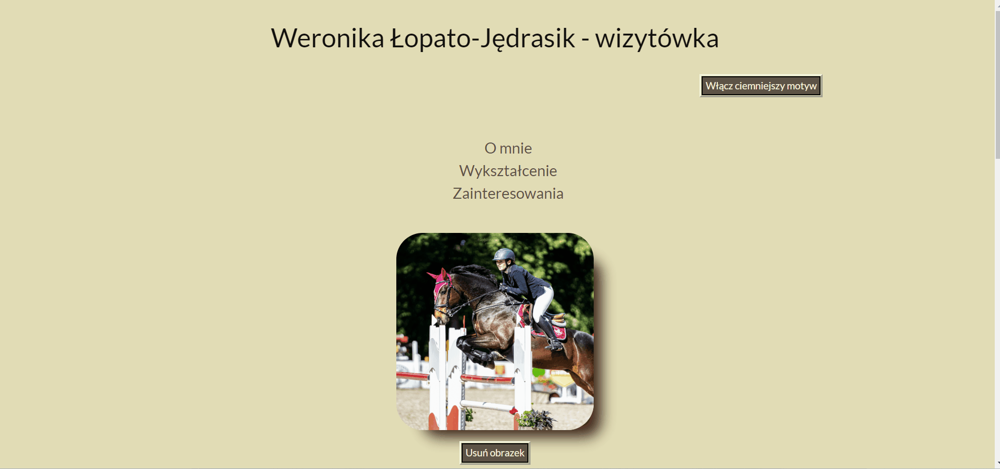

# Weronika Łopato-Jędrasik - my first website
This repository presents my first website. The homepage contains information about my private life, education and interests.

## Demo
https://werka481.github.io/homepage/
## Description
This is a simple project for my homepage. The homepage contains information about my private life, education and interests. Here you will find two interactions in Javascript. The first interaction removes the photo. The second interaction switches sides. At the end you can see a simple table. I invite you to view the screen of my website.

## Technologies used:
1. BEM
2. CSS Flex-box
3. ES6+ features
